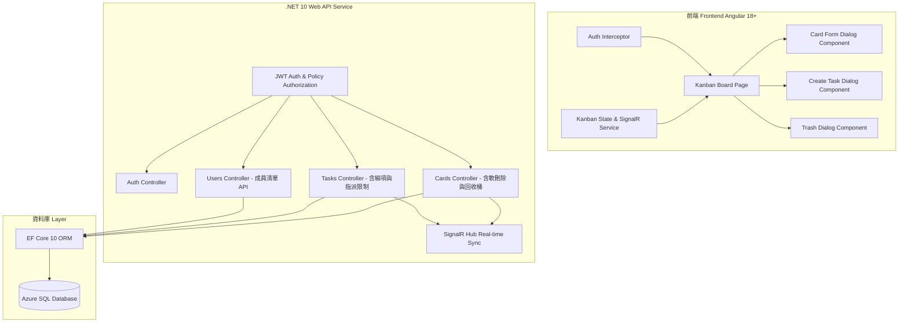
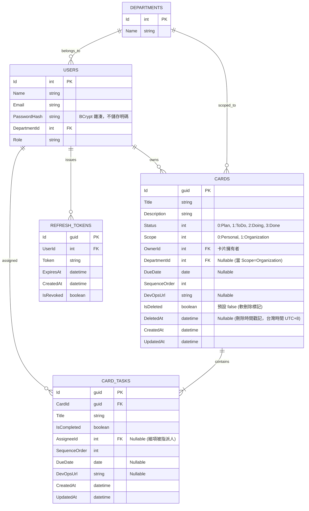

# 小型部門看板系統架構規劃書 (Kanban System Architecture Plan)

本規劃書針對小型部門專用的看板系統（類似 Trello）進行系統分析與架構設計。前端採用 **Angular 18+**，後端採用 **.NET 10**，資料庫使用 **Azure SQL Database**。

---

## 1. 系統架構總覽 (System Architecture Overview)



---

## 2. 資料庫設計 (Database Schema & ERD)

資料庫採用 **Azure SQL Database**，配合 Entity Framework Core 10 進行 ORM 管理，並具備全域 Query Filter 進行卡片軟刪除與回收桶管理。



### 資料表欄位重點說明
- **Users.PasswordHash**: 密碼一律以 BCrypt 雜湊後儲存，登入時使用 `BCrypt.Verify` 比對，資料庫與程式中皆不出現明碼。
- **RefreshTokens**: 每次登入/換發 Token 皆會產生一筆新記錄；`IsRevoked` 於登出或換發新 Token 時標記為 `true`，用於單向撤銷舊 Token。
- **Cards.IsDeleted & Cards.DeletedAt**: 實現卡片**軟刪除 (Soft Delete)** 與回收桶功能。EF Core 預設配置 `HasQueryFilter(c => !c.IsDeleted)` 濾除已被刪除之卡片；一般看板查詢將忽略軟刪除卡片，回收桶查詢與還原/永久刪除則使用 `IgnoreQueryFilters()`。
- **所有時間戳記欄位 (`CreatedAt` / `UpdatedAt` / `ExpiresAt` / `DeletedAt`)**: 統一透過後端 `DateTimeProvider.TaiwanNow` 取得台灣時間 (UTC+8)，不使用資料庫或伺服器預設 UTC 時間，確保前後端顯示與比對一致。
- **Cards.Scope**: 0 代表 `Personal` (個人)，1 代表 `Organization` (組織/部門)。
- **Cards.OwnerId**: 建立卡片的使用者，唯一具備**跨欄位移動該卡片**與**軟刪除/回收桶操作**權限的人。
- **Cards.DueDate / CardTasks.DueDate**: 僅需記錄日期，不記錄時間，資料庫型態使用 `date`。
- **Cards.SequenceOrder**: 卡片在同一個 `Status` 欄位中的排序值。若 Card Owner 調整順序，其他有權限看見該卡片的使用者會看到相同排序；排序屬於共享看板狀態，不是個人化排序。
- **Cards.DevOpsUrl / CardTasks.DevOpsUrl**: 可連結 Azure DevOps PBI、Feature、Bug 或其他開發單據，方便從看板追溯到工程工作項目。
- **CardTasks.AssigneeId**: Task 指派的特定人員。若卡片 Scope 為 `Organization`，可指派給部門其他同仁；若卡片 Scope 為 `Personal`，任務不可指派給他人（強制預設為 Card Owner）。

---

## 3. 權限與操作權限矩陣 (Permission Matrix)

為了實現「**指派人員可看卡片，但非 Owner 不能移卡，只能勾選 Task**」的核心邏輯，定義如下 RBAC/ABAC 權限矩陣：

| 角色/條件 | 檢視卡片 (View Card) | 編輯卡片內容 (Edit Card) | 變更卡片狀態/移動列表 (Move Card) | 軟刪除與回收桶還原/刪除 (Soft Delete & Trash) | 新增/編輯/刪除細項 (Manage Tasks) | 修改 Task 完成狀態 (Toggle Task) | Task 人員指派 (Assign Task) |
| :--- | :---: | :---: | :---: | :---: | :---: | :---: | :---: |
| **Card Owner (卡片擁有者)** | YES | YES | **YES** | **YES** | YES | YES | **YES** |
| **Task Assignee (細項被指派人)** | **YES** | NO | **NO** (唯讀鎖定) | **NO** | NO | **YES** (僅限自己負責的 Task) | NO |
| **同部門其他同仁** (Scope=Org) | YES | NO | NO | NO | NO | NO | NO |
| **非相關人員** (Personal/其他部門) | NO | NO | NO | NO | NO | NO | NO |

> **備註 (個人卡片 Task 指派限制)**：當卡片範疇為 `Personal` (個人) 時，Task 人員指派僅能為 Card Owner 本人。若嘗試將個人卡片中的 Task 指派給其他成員，API 將回應 `400 Bad Request` ("個人卡片的任務無法指派給他人。")。

---

## 4. 後端 .NET 10 API 設計與權限驗證

### 4.1 核心 Controller API Endpoints

```
[Auth Endpoints]
POST   /api/v1/auth/login                                # Email + 密碼登入 (BCrypt 驗證)，成功回傳 AccessToken(15分鐘) + RefreshToken(7天)
POST   /api/v1/auth/refresh                              # 以 RefreshToken 換發新的 AccessToken，並撤銷舊的 RefreshToken
POST   /api/v1/auth/logout                               # 撤銷指定的 RefreshToken

[User Endpoints]
GET    /api/v1/users?departmentId={departmentId}         # 取得使用者摘要清單 (Id, Name)，提供前端指派 Task 時選擇成員

[Card Endpoints]
GET    /api/v1/cards?viewMode={personal|organization}   # 取得當前使用者權限允許查看的看板卡片
GET    /api/v1/cards/{id}                               # 取得單一卡片詳細資料與 Tasks
POST   /api/v1/cards                                    # 建立新卡片 (Owner = CurrentUser)
PATCH  /api/v1/cards/{id}                               # 編輯卡片內容，如 Title、Description、DueDate、Scope、DevOpsUrl
PUT    /api/v1/cards/{id}/status                        # 移動卡片狀態與調整 SequenceOrder (僅限 Owner)
DELETE /api/v1/cards/{id}                               # 軟刪除卡片 (設定 IsDeleted = true, DeletedAt = TaiwanNow，僅限 Owner)
GET    /api/v1/cards/trash                              # 取得當前使用者已軟刪除之卡片列表 (回收桶，僅限 Owner)
POST   /api/v1/cards/{id}/restore                       # 還原軟刪除的卡片 (僅限 Owner)
DELETE /api/v1/cards/{id}/permanent                       # 永久從資料庫刪除卡片 (僅限 Owner)

[Task Endpoints]
POST   /api/v1/cards/{cardId}/tasks                      # 於卡片內新增細項 Task (僅限 Card Owner)
GET    /api/v1/tasks/{taskId}                           # 取得單一 Task 詳情
PATCH  /api/v1/tasks/{taskId}                           # 編輯 Task 內容，如 Title、DueDate、SequenceOrder、DevOpsUrl (僅限 Card Owner)
PATCH  /api/v1/tasks/{taskId}/toggle                    # 修改 Task 完成狀態 (Card Owner 或 Task Assignee)
PUT    /api/v1/tasks/{taskId}/assign                    # 變更 Task 指派人員 (僅限 Card Owner，若 Scope=Personal 則禁止指派他人)
DELETE /api/v1/tasks/{taskId}                           # 刪除 Task (僅限 Card Owner)
```

### 4.2 API Request/Response DTO 範例

```jsonc
// GET /api/v1/users?departmentId=1
// -> 200 OK
[
  { "id": 1, "name": "Alex Owner" },
  { "id": 2, "name": "Sam Assignee" }
]

// POST /api/v1/auth/login
{
  "email": "alex@example.com",
  "password": "Passw0rd!"
}
// -> 200 OK
{
  "accessToken": "eyJhbGciOi...",
  "refreshToken": "base64-random-token",
  "userId": 1,
  "name": "Alex Owner",
  "email": "alex@example.com",
  "role": "Owner",
  "departmentId": 1
}

// POST /api/v1/cards
{
  "title": "新建部門專案看板卡片",
  "description": "規劃 Q3 系統功能開發",
  "scope": 1,
  "departmentId": 1,
  "dueDate": "2026-08-30",
  "sequenceOrder": 100,
  "devOpsUrl": "https://dev.azure.com/org/project/_workitems/edit/123"
}

// PUT /api/v1/tasks/{taskId}/assign
{
  "assigneeId": 2,
  "updatedAt": "2026-07-25T01:00:00+08:00"
}
```

> `updatedAt` 為樂觀比對欄位：當請求傳入 `updatedAt` 且與資料庫目前值不一致時，API 會傳回 `409 Conflict`。

### 4.3 API 錯誤處理標準

- **400 Bad Request**: Request body 格式錯誤、欄位驗證失敗、`Status` / `Scope` 超出 Enum 定義，或是對**個人卡片**進行跨人員 Task 指派。
- **401 Unauthorized**: 未登入、JWT 無效/過期，或登入時 Email/密碼錯誤、`refresh`/`logout` 時 RefreshToken 無效或已過期/撤銷。
- **403 Forbidden**: 已登入但不具備操作權限，包含：
  - 非 Owner 嘗試編輯/移動/刪除/還原卡片，或非 Owner 嘗試新增/編輯/指派/刪除 Task。
  - 非 Owner 且非 Task Assignee、也非同部門成員檢視卡片/Task 詳情。
- **404 Not Found**: 卡片、Task 或指派使用者不存在（或存取非垃圾桶中的軟刪除資源）。
- **409 Conflict**: 多人同時編輯造成 `UpdatedAt` 版本衝突，前端需重新取得最新資料後再送出。

### 4.4 .NET 10 權限服務實做邏輯 (`CardAuthorizationService`)

```csharp
public sealed class CardAuthorizationService
{
    // 判斷是否具備編輯卡片內容、移動狀態、刪除與管理 Task 的權限 (僅 Owner)
    public bool CanEditCard(int currentUserId, Card card) => card.OwnerId == currentUserId;
    public bool CanMoveCard(int currentUserId, Card card) => card.OwnerId == currentUserId;
    public bool CanManageTasks(int currentUserId, Card card) => card.OwnerId == currentUserId;

    // 判斷是否具備勾選 Task 完成狀態的權限 (Owner 或 Task Assignee)
    public bool CanToggleTask(int currentUserId, CardTask task, Card card)
    {
        return card.OwnerId == currentUserId || task.AssigneeId == currentUserId;
    }

    // 取得使用者可看見的卡片列表 (LINQ Query Filter，自動忽略 IsDeleted=true 的卡片)
    public IQueryable<Card> GetAccessibleCardsQuery(
        AppDbContext db,
        int userId,
        int userDepartmentId,
        string? viewMode)
    {
        if (string.Equals(viewMode, "organization", StringComparison.OrdinalIgnoreCase))
        {
            return db.Cards.Where(card =>
                card.Scope == CardScope.Organization
                && (card.DepartmentId == userDepartmentId || card.Tasks.Any(task => task.AssigneeId == userId)));
        }

        return db.Cards.Where(card => card.OwnerId == userId && card.Scope == CardScope.Personal);
    }
}
```

### 4.5 SignalR 即時事件廣播設計

| 事件名稱 | 觸發時機 | 廣播範圍 |
| :--- | :--- | :--- |
| `CardCreated` | 建立卡片成功，或從回收桶還原卡片成功 | 卡片 Owner；若 Scope=Organization，則包含同部門使用者 Group |
| `CardUpdated` | 編輯卡片標題/內容/範疇/到期日成功 | 所有可檢視該卡片的使用者與部門 Group |
| `CardMoved` | 卡片 Status 或 SequenceOrder 移動變更成功 | 所有可檢視該卡片的使用者與部門 Group |
| `CardDeleted` | 卡片被軟刪除成功 | 所有原本可檢視該卡片的使用者與部門 Group |
| `TaskUpdated` | 新增、編輯、刪除、指派或勾選 Task 成功 | 所有可檢視該卡片的使用者與部門 Group |

---

## 5. 前端 Angular 開發規劃

### 5.1 元件層級與結構 (Component Hierarchy)

```
Web/src/app/
├── auth.interceptor.ts                    # JWT Token 自動附加與過期處理
├── features/
│   ├── auth/
│   │   └── pages/
│   │       └── login-page/                # 登入頁面元件
│   └── kanban/
│       ├── components/
│       │   ├── card-form-dialog/          # 卡片新增與編輯對話框 (Card Form Dialog)
│       │   ├── create-task-dialog/        # 任務新增與成員指派對話框 (Task Dialog)
│       │   └── trash-dialog/              # 回收桶對話框 (軟刪除列表、還原與永久刪除)
│       ├── models/
│       │   └── kanban.models.ts           # 卡片、任務、使用者與請求模型定義
│       ├── pages/
│       │   └── kanban-board-page/         # 主看板頁面 (包含 4 欄 Column、個人/組織切換與回收桶按鈕)
│       └── services/
│           ├── kanban.service.ts          # HTTP API 串接服務
│           └── kanban-state.service.ts    # Angular Signals 狀態與 SignalR 即時同步
```

### 5.2 看板 Drag-and-Drop 權限防護 (Angular CDK DragDrop)

在 Angular 中使用 `@angular/cdk/drag-drop`，透過 `cdkDragDisabled` 動態限制非 Card Owner 無法拖曳卡片：

```html
<!-- kanban-board-page.component.html (卡片繪製邏輯範例) -->
<div class="kanban-card-item"
     cdkDrag
     [cdkDragDisabled]="!isOwner(card)"
     [class.read-only-card]="!isOwner(card)">

  <div class="card-header">
    <span class="badge" [class.badge-org]="card.scope === 1">
      {{ card.scope === 1 ? '組織' : '個人' }}
    </span>
    <h3>{{ card.title }}</h3>
  </div>

  <!-- 卡片內部 Tasks -->
  <div class="task-summary">
    <div *ngFor="let task of card.tasks" class="task-item">
      <input type="checkbox"
             [checked]="task.isCompleted"
             [disabled]="!canToggleTask(card, task)"
             (change)="onToggleTask(task)" />
      <span [class.completed]="task.isCompleted">{{ task.title }}</span>
      <span class="assignee-tag" *ngIf="task.assigneeName">@{{ task.assigneeName }}</span>
    </div>
  </div>

  <div *ngIf="!isOwner(card)" class="readonly-notice">
    <small>🔒 您因 Task 指派參與此卡片 (唯讀檢視)</small>
  </div>
</div>
```

---

## 6. 開發與部署建議 (Deployment & Execution Roadmap)

1. **第一階段：Database & API Core (已完成)**
   - 建立 Azure SQL Database 資源並使用 EF Core Migration 建置 Schema。
   - 實作 Card / Task 的 `DueDate`、`SequenceOrder`、`DevOpsUrl`、`UpdatedAt` 欄位與 `IsDeleted` / `DeletedAt` 軟刪除全域 Query Filter。
   - 撰寫 Card & Task 的 CRUD API 與 JWT Authentication（Access Token + Refresh Token，密碼以 BCrypt 雜湊）。
   - 撰寫 User Summary API (`GET /api/v1/users`) 供前端指派成員。
   - 設定 CORS 政策，並以 .NET 10 原生 OpenAPI + Scalar UI 取代傳統 Swagger UI 提供互動式 API 文件。

2. **第二階段：Angular 介面與 Drag-and-Drop (已完成)**
   - 建置 Angular 18+ 專案，整合 `@angular/cdk/drag-drop`。
   - 實作 4 個 State Column (`Plan`, `To Do`, `Doing`, `Done`)。
   - 實作 `CardFormDialogComponent` 與 `CreateTaskDialogComponent` 進行卡片/任務建立與人員指派。
   - 實作 `TrashDialogComponent` 回收桶彈窗（卡片軟刪除檢視、還原與永久刪除操作）。
   - 實作權限連動（非 Owner 卡片拖拉鎖定，僅被指派者可勾選 Task，個人卡片禁止指派他人）。

3. **第三階段：即時同步與 UI 優化 (已完成)**
   - 整合 **.NET 10 SignalR Hub (KanbanHub)**，當異動卡片、排序、Task 狀態或拖移卡片時，同部門/相關成員看板頁面可實時 (Real-time) 收到更新。
   - 完成繁體中文 UI 介面與質感優化。

4. **第四階段：CI/CD 與 Azure 部署準備 (進行中)**
   - 配置 `azure-pipelines-api.yml`、`azure-pipelines-db.yml` 與 `azure-pipelines-web.yml`。

---

> [!NOTE]
> 本規劃案完全符合目前程式庫中所有現行 API 規格、資料庫結構與前端 Angular 元件機制，可作為開發營運之權威設計規範。
