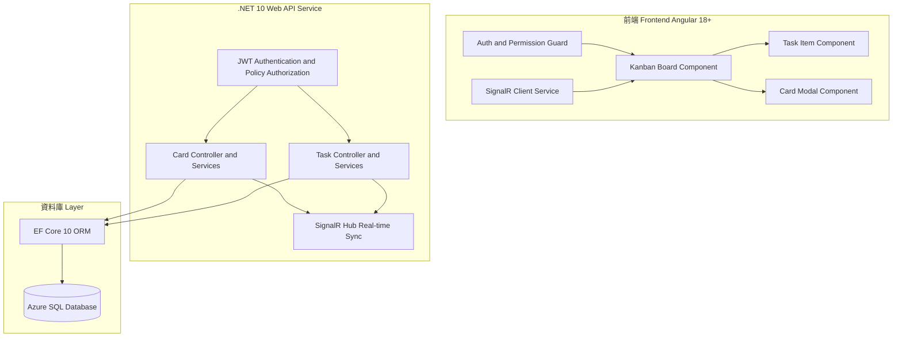
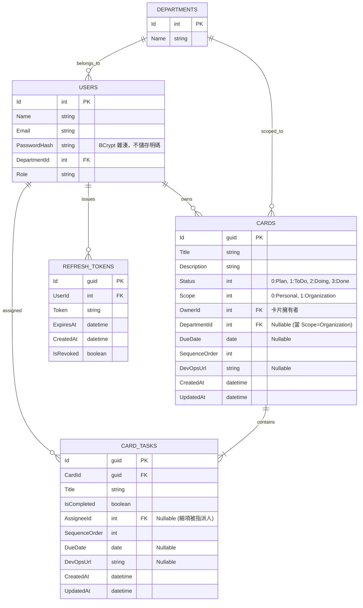

# 小型部門看板系統架構規劃書 (Kanban System Architecture Plan)

本規劃書針對小型部門專用的看板系統（類似 Trello）進行系統分析與架構設計。前端採用 **Angular**，後端採用 **.NET 10**，資料庫使用 **Azure SQL Database**。

---

## 1. 系統架構總覽 (System Architecture Overview)



---

## 2. 資料庫設計 (Database Schema & ERD)

資料庫採用 **Azure SQL Database**，配合 Entity Framework Core 10 進行 ORM 管理。



### 資料表欄位重點說明
- **Users.PasswordHash**: 密碼一律以 BCrypt 雜湊後儲存，登入時使用 `BCrypt.Verify` 比對，資料庫與程式中皆不出現明碼。
- **RefreshTokens**: 每次登入/換發 Token 皆會產生一筆新記錄；`IsRevoked` 於登出或換發新 Token 時標記為 `true`，用於單向撤銷舊 Token。
- **所有時間戳記欄位 (`CreatedAt` / `UpdatedAt` / `ExpiresAt`)**: 統一透過後端 `DateTimeProvider.TaiwanNow` 取得台灣時間 (UTC+8)，不使用資料庫或伺服器預設 UTC 時間，確保前後端顯示與比對一致。
- **Cards.Scope**: 0 代表 `Personal` (個人)，1 代表 `Organization` (組織/部門)。
- **Cards.OwnerId**: 建立卡片的使用者，唯一具備**跨欄位移動該卡片**權限的人。
- **Cards.DueDate / CardTasks.DueDate**: 僅需記錄日期，不記錄時間，資料庫型態建議使用 `date`。
- **Cards.SequenceOrder**: 卡片在同一個 `Status` 欄位中的排序值。若 Card Owner 調整順序，其他有權限看見該卡片的使用者會看到相同排序；排序屬於共享看板狀態，不是個人化排序。
- **Cards.DevOpsUrl / CardTasks.DevOpsUrl**: 可連結 Azure DevOps PBI、Feature、Bug 或其他開發單據，方便從看板追溯到工程工作項目。
- **CardTasks.AssigneeId**: Task 指派的特定人員。即使該人員不是 Card Owner，只要該 Task 指派給他，他就能在看板中看到該卡片，並更改該 Task 的 `IsCompleted` 狀態。

---

## 3. 權限與操作權限矩陣 (Permission Matrix)

為了實現「**指派人員可看卡片，但非 Owner 不能移卡，只能勾選 Task**」的核心邏輯，定義如下 RBAC/ABAC 權限矩陣：

| 角色/條件 | 檢視卡片 (View Card) | 編輯卡片內容 (Edit Card) | 變更卡片狀態/移動列表 (Move Card) | 新增/編輯/刪除細項 (Manage Tasks) | 修改 Task 完成狀態 (Toggle Task) |
| :--- | :---: | :---: | :---: | :---: | :---: |
| **Card Owner (卡片擁有者)** |  YES |  YES |  **YES** |  YES |  YES |
| **Task Assignee (細項被指派人)** |  **YES** |  NO |  **NO** (唯讀鎖定) |  NO |  **YES** (僅限自己負責的 Task) |
| **同部門其他同仁** (Scope=Org) |  YES |  NO |  NO |  NO |  NO |
| **非相關人員** (Personal/其他部門) |  NO |  NO |  NO |  NO |  NO |

---

## 4. 後端 .NET 10 API 設計與權限驗證

### 4.1 核心 Controller API Endpoints

```
[Auth Endpoints]
POST   /api/v1/auth/login                                # Email + 密碼登入 (BCrypt 驗證)，成功回傳 AccessToken(15分鐘) + RefreshToken(7天)
POST   /api/v1/auth/refresh                              # 以 RefreshToken 換發新的 AccessToken，並撤銷舊的 RefreshToken
POST   /api/v1/auth/logout                                # 撤銷指定的 RefreshToken

[Card Endpoints]
GET    /api/v1/cards?viewMode={personal|organization}   # 取得當前使用者權限允許查看的看板卡片
GET    /api/v1/cards/{id}                               # 取得單一卡片詳細資料與 Tasks
POST   /api/v1/cards                                    # 建立新卡片 (Owner = CurrentUser)
PATCH  /api/v1/cards/{id}                               # 編輯卡片內容，如 Title、Description、DueDate、Scope、DevOpsUrl (需要 Owner 權限 Check)
PUT    /api/v1/cards/{id}/status                        # 移動卡片狀態與調整 SequenceOrder (需要 Owner 權限 Check)
DELETE /api/v1/cards/{id}                               # 刪除卡片 (僅限 Owner)

[Task Endpoints]
POST   /api/v1/cards/{cardId}/tasks                      # 於卡片內新增細項 Task (僅限 Card Owner)
PATCH  /api/v1/tasks/{taskId}                           # 編輯 Task 內容，如 Title、DueDate、SequenceOrder、DevOpsUrl (僅限 Card Owner)
PATCH  /api/v1/tasks/{taskId}/toggle                    # 修改 Task 完成狀態 (Card Owner 或 Task Assignee)
PUT    /api/v1/tasks/{taskId}/assign                    # 變更 Task 指派人員 (僅限 Card Owner)
DELETE /api/v1/tasks/{taskId}                           # 刪除 Task (僅限 Card Owner)
```

### 4.2 API Request DTO 範例

```jsonc
// POST /api/v1/auth/login
{
  "email": "user@example.com",
  "password": "P@ssw0rd"
}
// -> 200 OK
{
  "accessToken": "eyJhbGciOi...",
  "refreshToken": "base64-random-token",
  "userId": 1,
  "name": "王小明",
  "email": "user@example.com",
  "role": "Member",
  "departmentId": 1
}

// POST /api/v1/auth/refresh、POST /api/v1/auth/logout
{
  "refreshToken": "base64-random-token"
}

// PATCH /api/v1/cards/{id}
{
  "title": "更新後標題",
  "description": "更新後說明",
  "dueDate": "2026-08-15",
  "scope": 1,
  "devOpsUrl": "https://dev.azure.com/org/project/_workitems/edit/12345",
  "updatedAt": "2026-07-20T10:00:00+08:00"
}

// PUT /api/v1/cards/{id}/status
{
  "status": 2,
  "sequenceOrder": 300,
  "updatedAt": "2026-07-20T10:00:00+08:00"
}

// PATCH /api/v1/tasks/{taskId}
{
  "title": "更新 Task 標題",
  "dueDate": "2026-08-16",
  "sequenceOrder": 100,
  "devOpsUrl": "https://dev.azure.com/org/project/_workitems/edit/67890",
  "updatedAt": "2026-07-20T10:00:00+08:00"
}
```

> `updatedAt` 為樂觀鎖比對欄位：若請求帶入的 `updatedAt` 與資料庫目前值不一致，API 回傳 `409 Conflict`（詳見 4.3）。

### 4.3 API 錯誤處理標準

- **400 Bad Request**: Request body 格式錯誤、欄位驗證失敗，或 `Status` / `Scope` 超出 Enum 定義。
- **401 Unauthorized**: 未登入、JWT 無效/過期，或登入時 Email/密碼錯誤、`refresh`/`logout` 時 RefreshToken 無效或已過期/撤銷。
- **403 Forbidden**: 已登入但不具備操作權限，包含：
  - 非 Owner 嘗試編輯/移動/刪除卡片，或非 Owner 嘗試新增/編輯/指派/刪除 Task。
  - 非 Owner 且非 Task Assignee、也非同部門成員檢視卡片/Task 詳情（`GET /cards/{id}`、`GET /tasks/{taskId}`）。
- **404 Not Found**: 卡片、Task 或指派使用者不存在（純粹資源不存在，與權限判斷無關）。
- **409 Conflict**: 多人同時編輯造成 `UpdatedAt` 版本衝突，前端需重新取得最新資料後再送出。

### 4.4 .NET 10 權限邏輯 (Policy / Domain Service) 範例

```csharp
public sealed class CardAuthorizationService
{
    // 判斷是否具備編輯卡片內容的權限 (僅 Owner)
    public bool CanEditCard(int currentUserId, Card card) => card.OwnerId == currentUserId;

    // 判斷是否具備移動卡片狀態的權限 (僅 Owner)
    public bool CanMoveCard(int currentUserId, Card card) => card.OwnerId == currentUserId;

    // 判斷是否具備新增/編輯/指派/刪除 Task 的權限 (僅 Owner)
    public bool CanManageTasks(int currentUserId, Card card) => card.OwnerId == currentUserId;

    // 判斷是否具備更新 Task 完成狀態的權限 (Owner 或 Task Assignee)
    public bool CanToggleTask(int currentUserId, CardTask task, Card card)
    {
        return card.OwnerId == currentUserId || task.AssigneeId == currentUserId;
    }

    // 取得使用者可看見的卡片列表 (LINQ Query Filter)
    public IQueryable<Card> GetAccessibleCardsQuery(AppDbContext db, int userId, int userDeptId, string? viewMode)
    {
        if (string.Equals(viewMode, "organization", StringComparison.OrdinalIgnoreCase))
        {
            return db.Cards.Where(c => c.Scope == CardScope.Organization &&
                (c.DepartmentId == userDeptId || c.Tasks.Any(t => t.AssigneeId == userId)));
        }

        return db.Cards.Where(c => c.OwnerId == userId && c.Scope == CardScope.Personal);
    }
}
```

### 4.5 SignalR 事件設計

| 事件名稱 | 觸發時機 | 廣播範圍 |
| :--- | :--- | :--- |
| `CardCreated` | 建立卡片成功 | 卡片 Owner；若 Scope=Organization，則同部門使用者 |
| `CardUpdated` | 編輯卡片內容成功 | 所有可檢視該卡片的使用者 |
| `CardMoved` | 卡片 Status 或 SequenceOrder 變更成功 | 所有可檢視該卡片的使用者 |
| `CardDeleted` | 刪除卡片成功 | 所有原本可檢視該卡片的使用者 |
| `TaskUpdated` | 新增、編輯、刪除、指派或勾選 Task 成功 | 所有可檢視該卡片的使用者 |

**廣播機制實作細節**：
- `KanbanHub` 提供 `JoinDepartmentGroup(departmentId)` / `LeaveDepartmentGroup(departmentId)` 方法，前端連線後依使用者所屬部門加入對應的 SignalR Group，Group 命名規則為 `department:{departmentId}`。
- 後端事件發送時，同時對「卡片 Owner」（透過 `Clients.User(ownerId)`，需 JWT 帶入 `NameIdentifier` claim 作為使用者識別）與「卡片所屬部門 Group」（當 `Scope = Organization`）廣播，確保 Owner 與同部門成員都能即時收到更新。

---

## 5. 前端 Angular 開發規劃

### 5.1 元件層級與結構 (Component Hierarchy)

```
app/
├── features/
│   └── kanban/
│       ├── pages/
│       │   └── kanban-board-page/          # 主看板頁面 (包含 Personal / Org 切換頁籤)
│       ├── components/
│       │   ├── kanban-column/             # 4個列表 (Plan, To Do, Doing, Done)
│       │   ├── kanban-card/               # 卡片元件 (處理 Drag 限制與 Display)
│       │   ├── task-list/                 # 細項 Task 列表與 Checkbox
│       │   └── card-detail-modal/         # 卡片詳情與細項指派彈窗
│       └── services/
│           ├── kanban.service.ts          # API 介面串接
│           └── kanban-state.service.ts    # Signals / BehaviorSubject 狀態管理
```

### 5.2 看板 Drag-and-Drop 權限防護 (Angular CDK DragDrop)

在 Angular 中使用 `@angular/cdk/drag-drop`，透過 `cdkDragDisabled` 動態限制非 Card Owner 無法拖曳卡片：

```html
<!-- kanban-card.component.html -->
<div class="kanban-card-item"
     cdkDrag
     [cdkDragDisabled]="!isOwner"
     [class.read-only-card]="!isOwner">

  <div class="card-header">
    <span class="badge" [class.badge-org]="card.scope === 1">
      {{ card.scope === 1 ? '組織' : '個人' }}
    </span>
    <h3>{{ card.title }}</h3>
  </div>

  <!-- 卡片內部 Tasks -->
  <div class="task-summary">
    <div *ngFor="let task of card.tasks" class="task-item">
      <input type="checkbox"
             [checked]="task.isCompleted"
             [disabled]="!canToggleTask(task)"
             (change)="onToggleTask(task)" />
      <span [class.completed]="task.isCompleted">{{ task.title }}</span>
      <span class="assignee-tag" *ngIf="task.assigneeName">@{{ task.assigneeName }}</span>
    </div>
  </div>

  <div *ngIf="!isOwner" class="readonly-notice">
    <small>🔒 您因 Task 指派參與此卡片 (唯讀選單)</small>
  </div>
</div>
```

---

## 6. 開發與部署建議 (Deployment & Execution Roadmap)

1. **第一階段：Database & API Core (1-2 週)**
   - 建立 Azure SQL Database 資源並使用 EF Core Migration 建置 Schema。
   - 建立 Card / Task 的 `DueDate`、`SequenceOrder`、`DevOpsUrl`、`UpdatedAt` 欄位。
   - 撰寫 Card & Task 的 CRUD API 與 JWT Authentication（Access Token + Refresh Token，密碼以 BCrypt 雜湊）。
   - 設定 CORS 政策，並以 .NET 10 原生 OpenAPI + Scalar UI 取代傳統 Swagger UI 提供互動式 API 文件。
   - 單元測試權限邏輯 (Card Owner vs Task Assignee) 與 `UpdatedAt` 樂觀鎖衝突處理。

2. **第二階段：Angular 介面與 Drag-and-Drop (1-2 週)**
   - 建立 Angular 專案，整合 `@angular/cdk/drag-drop`。
   - 實作 4 個 State Column (`Plan`, `To Do`, `Doing`, `Done`)。
   - 實作卡片與 Task 的排序、Due Date、DevOps URL 顯示與編輯。
   - 實作權限連動（非 Owner 的卡片拖拉鎖定，僅被指派 Task 可勾選）。

3. **第三階段：即時同步與 UI 優化 (1 週)**
   - 加入 **.NET 10 SignalR Hub**，讓部門同仁在異動卡片、排序、Task 狀態或拖移卡片時，其他人看板頁面可實時 (Real-time) 更新。
   - 視覺設計與優化 (Dark/Light mode 兼具，高質感 Trello 風格 UI)。

---

> [!NOTE]
> 本規劃案完全符合需求中的**權限分級**與**跨視角檢視**邏輯，可直接作為後續工程團隊（.NET & Angular）開發執行之規格文件。
