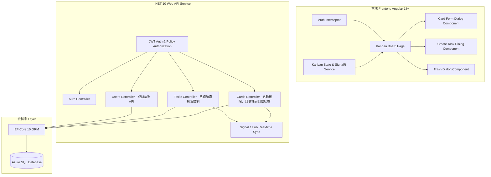
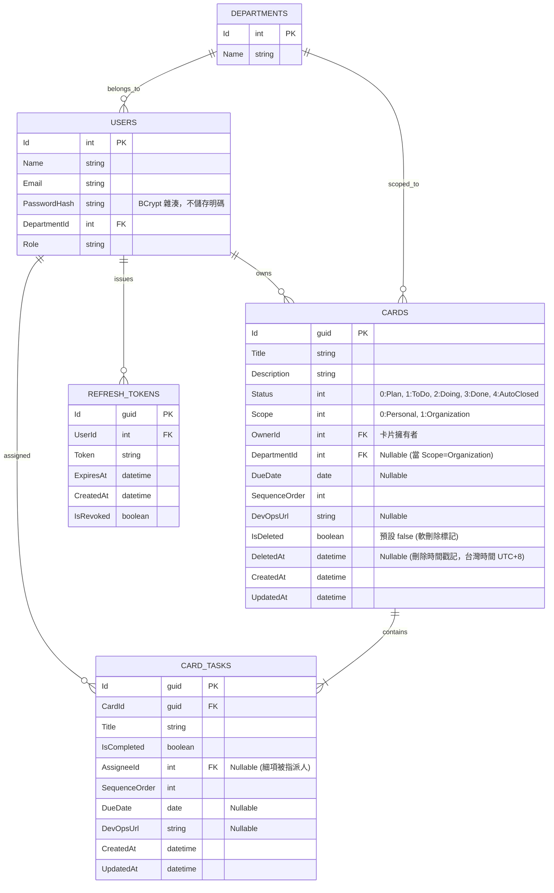

# 小型部門看板系統架構規劃書 (Kanban System Architecture Plan)

本規劃書針對小型部門專用的看板系統（類似 Trello）進行系統分析與架構設計。前端採用 **Angular 18+**，後端採用 **.NET 10**，資料庫使用 **Azure SQL Database**。

---

## 1. 系統架構總覽 (System Architecture Overview)



---

## 2. 資料庫設計 (Database Schema & ERD)

資料庫採用 **Azure SQL Database**，配合 Entity Framework Core 10 進行 ORM 管理，具備全域 Query Filter 進行卡片軟刪除過濾，並支援上個月已完成卡片之自動結案機制。



### 資料表欄位重點說明
- **Users.PasswordHash**: 密碼一律以 BCrypt 雜湊後儲存，登入時使用 `BCrypt.Verify` 比對，資料庫與程式中皆不出現明碼。
- **Cards.Status**: 0 代表 `Plan`, 1 代表 `ToDo`, 2 代表 `Doing`, 3 代表 `Done`, 4 代表 `AutoClosed` (自動結案)。系統規劃每個月批次將前一個月已完成 (`Done`) 的卡片狀態更新為 `AutoClosed`。
- **看板預設隱藏機制 (AutoClosed & IsDeleted)**：已結案 (`AutoClosed`) 的卡片與已被軟刪除 (`IsDeleted = true`) 的卡片，預設**一律不顯示於主看板介面上** (`GetAccessibleCardsQuery` 自動排除 `card.Status == CardStatus.AutoClosed`)。
- **Cards.IsDeleted & Cards.DeletedAt**: 實現卡片**軟刪除 (Soft Delete)** 與回收桶功能。EF Core 預設配置 `HasQueryFilter(c => !c.IsDeleted)` 濾除已被刪除之卡片。
- **所有時間戳記欄位 (`CreatedAt` / `UpdatedAt` / `ExpiresAt` / `DeletedAt`)**: 統一透過後端 `DateTimeProvider.TaiwanNow` 取得台灣時間 (UTC+8)。
- **Cards.Scope**: 0 代表 `Personal` (個人)，1 代表 `Organization` (組織/部門)。
- **Cards.OwnerId**: 建立卡片的使用者，唯一具備跨欄位移動、編輯與刪除權限。
- **CardTasks.AssigneeId**: Task 指派的特定人員。若卡片 Scope 為 `Organization`，可指派給部門其他同仁；若卡片 Scope 為 `Personal`，任務不可指派給他人（強制預設為 Card Owner）。

---

## 3. 權限與操作權限矩陣 (Permission Matrix)

| 角色/條件 | 檢視看板主介面 (View Board) | 編輯卡片內容 (Edit Card) | 變更卡片狀態 (Move Card) | 軟刪除與回收桶 (Soft Delete & Trash) | 自動結案與封存 (Auto-Close & Archive) | 修改 Task 完成狀態 (Toggle Task) |
| :--- | :---: | :---: | :---: | :---: | :---: | :---: |
| **Card Owner (卡片擁有者)** | YES | YES | **YES** | **YES** | **YES** | YES |
| **Task Assignee (細項被指派人)** | **YES** | NO | **NO** (唯讀鎖定) | **NO** | NO | **YES** (僅限自己 Task) |
| **同部門其他同仁** (Scope=Org) | YES | NO | NO | NO | NO | NO |
| **已結案卡片 (AutoClosed)** | **隱藏** | N/A | N/A | N/A | 可至封存區檢視 | N/A |
| **已軟刪除卡片 (IsDeleted)** | **隱藏** | N/A | N/A | 可至回收桶還原/刪除 | N/A | N/A |

---

## 4. 後端 .NET 10 API 設計與權限驗證

### 4.1 核心 Controller API Endpoints

```
[Auth Endpoints]
POST   /api/v1/auth/login                                # Email + 密碼登入 (BCrypt 驗證)
POST   /api/v1/auth/refresh                              # 以 RefreshToken 換發新的 AccessToken
POST   /api/v1/auth/logout                               # 撤銷指定的 RefreshToken

[User Endpoints]
GET    /api/v1/users?departmentId={departmentId}         # 取得使用者摘要清單 (Id, Name)

[Card Endpoints]
GET    /api/v1/cards?viewMode={personal|organization}   # 取得當前看板卡片 (預設排除 AutoClosed 與 IsDeleted 卡片)
GET    /api/v1/cards/{id}                               # 取得單一卡片詳細資料與 Tasks
POST   /api/v1/cards                                    # 建立新卡片
PATCH  /api/v1/cards/{id}                               # 編輯卡片內容
PUT    /api/v1/cards/{id}/status                        # 移動卡片狀態與調整 SequenceOrder
DELETE /api/v1/cards/{id}                               # 軟刪除卡片 (移至回收桶，預設不顯示於看板)
POST   /api/v1/cards/auto-close-previous-month          # 批次將上個月已完成 (Done) 之卡片自動更新為結案 (AutoClosed)
GET    /api/v1/cards/closed                             # 取得已結案 (AutoClosed) 之卡片列表
GET    /api/v1/cards/trash                              # 取得當前使用者已軟刪除之卡片列表 (回收桶)
POST   /api/v1/cards/{id}/restore                       # 還原軟刪除的卡片
DELETE /api/v1/cards/{id}/permanent                       # 永久從資料庫刪除卡片

[Task Endpoints]
POST   /api/v1/cards/{cardId}/tasks                      # 於卡片內新增細項 Task
GET    /api/v1/tasks/{taskId}                           # 取得單一 Task 詳情
PATCH  /api/v1/tasks/{taskId}                           # 編輯 Task 內容
PATCH  /api/v1/tasks/{taskId}/toggle                    # 修改 Task 完成狀態
PUT    /api/v1/tasks/{taskId}/assign                    # 變更 Task 指派人員
DELETE /api/v1/tasks/{taskId}                           # 刪除 Task
```

### 4.2 .NET 10 權限服務實做邏輯 (`CardAuthorizationService`)

```csharp
public sealed class CardAuthorizationService
{
    public bool CanEditCard(int currentUserId, Card card) => card.OwnerId == currentUserId;
    public bool CanMoveCard(int currentUserId, Card card) => card.OwnerId == currentUserId;
    public bool CanManageTasks(int currentUserId, Card card) => card.OwnerId == currentUserId;

    public bool CanToggleTask(int currentUserId, CardTask task, Card card)
    {
        return card.OwnerId == currentUserId || task.AssigneeId == currentUserId;
    }

    // 取得使用者可看見的卡片列表 (預設過濾 Status != AutoClosed 與 IsDeleted != true)
    public IQueryable<Card> GetAccessibleCardsQuery(
        AppDbContext db,
        int userId,
        int userDepartmentId,
        string? viewMode)
    {
        if (string.Equals(viewMode, "organization", StringComparison.OrdinalIgnoreCase))
        {
            return db.Cards.Where(card =>
                card.Status != CardStatus.AutoClosed
                && card.Scope == CardScope.Organization
                && (card.DepartmentId == userDepartmentId || card.Tasks.Any(task => task.AssigneeId == userId)));
        }

        return db.Cards.Where(card => card.Status != CardStatus.AutoClosed && card.OwnerId == userId && card.Scope == CardScope.Personal);
    }
}
```

---

## 5. 前端 Angular 開發規劃

### 5.1 狀態與模型

- **`CardStatus` Enum**: `Plan = 0`, `ToDo = 1`, `Doing = 2`, `Done = 3`, `AutoClosed = 4`.
- **主看板欄位渲染**: 看板頁面固定渲染 4 個欄位 (`Plan`, `ToDo`, `Doing`, `Done`)。已結案 (`AutoClosed`) 之卡片將被自動過濾，不佔用看板視覺空間。

---

## 6. 開發與部署建議

1. **已完成自動結案機制**:
   - `CardStatus` 成功擴充 `AutoClosed = 4`。
   - 後端實作 `POST /api/v1/cards/auto-close-previous-month` 自動將前月份完成之卡片轉為結案。
   - 主看板查詢條件已強化，自動排除 `AutoClosed` 與 `IsDeleted` 卡片。

---

> [!NOTE]
> 本規劃案符合所有關於已刪除與已結案卡片預設隱藏之最新業務規格。
